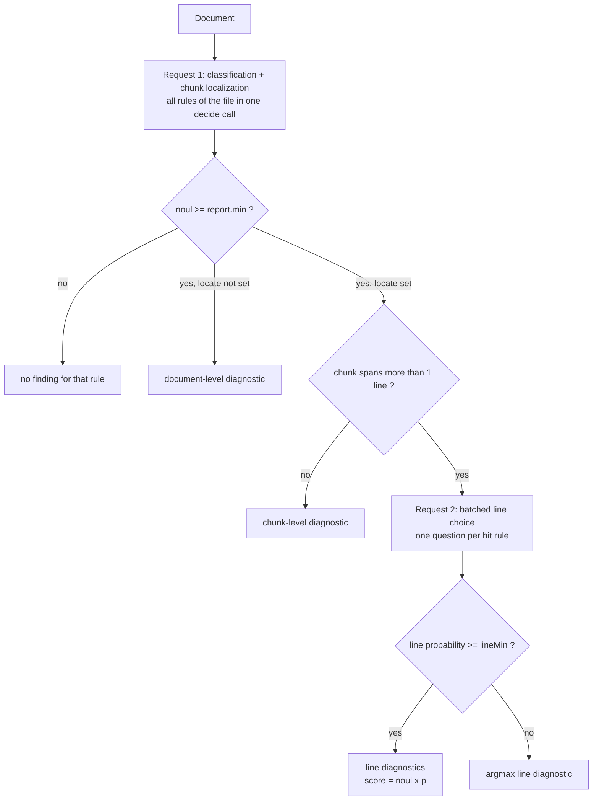
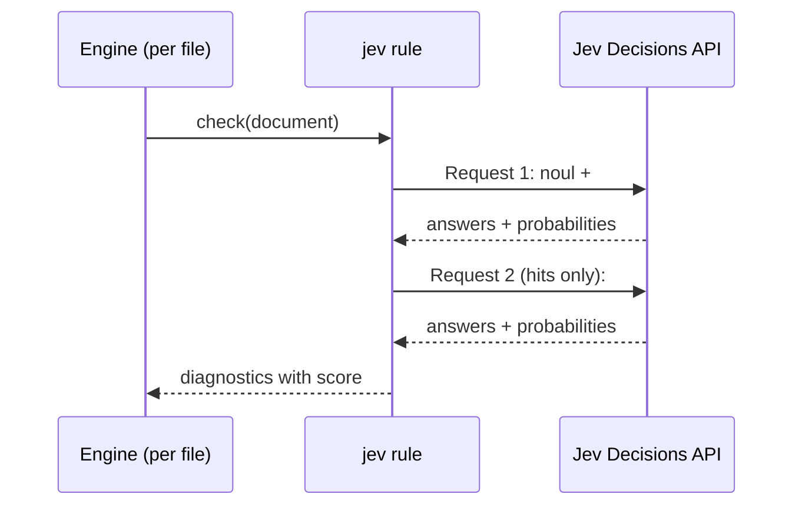

# Spec: AI linting with Jev

flint's AI analysis layer. Jev (TypeSafe System One) is called through the
OpenRouter Decisions API for typed, batched, probabilistic answers about each
file. This document is the source of truth for the design.

Refs: `docs/jev-openrouter-langchain.md`, `src/lib/ai/jev.ts`, `src/lib/lint/rules/jev.ts`

## 1. Overview

User-defined rules are short prompts with thresholds, expressed as Jev **noul**
questions (`{ rule_name, prompt, threshold }` → question key, `instructions`,
`report.min`). Jev evaluates all questions of a file in parallel inside a single
request, so flint batches every rule of a file together:

1. **Classify + localize — one request per file.** One `decide` call carries a
   classification question per rule plus a localization (choice) question per
   rule that opts into `locate`. The localization question asks Jev to pick the
   file section (chunk) exhibiting the issue.
2. **Refine — one request per file.** For every rule whose noul crossed its
   threshold, a second batched `decide` call asks a choice question over the
   lines of the chosen chunk. flint reports every line whose probability clears
   `report.lineMin`.

Findings are `file + line + rule code + score`, where
`score = noul × chosen-option probability`. The number of requests per file is
constant (1–2) regardless of rule count: adding rules adds tokens but barely
adds latency.

The pretty formatter renders AI findings as code frames (contiguous runs,
2 context lines, red shades by score). JSON carries `score` and the full answer
breakdown.

## 2. Goals and non-goals

Goals:

- Jev is a core built-in rule: no opt-in flag, no separate enablement.
- Config-defined questions through `rules.jev.options.questions`.
- Two-stage funnel (classification → localization → line refinement) batched per
  file: all rules at once.
- Deterministic, testable core: question construction, answer mapping, and scoring
  are pure functions; the Jev client takes an injectable `fetch`, so tests stay
  offline.
- Scores and full answer data in JSON; code frames with red shades in pretty.
- Crash isolation: a failed request is a tool diagnostic, never a crashed run.

Non-goals (v1):

- Cross-file or repo-level analysis.
- Caching (section 5.11, first follow-up).
- Multiple chunks per rule per file (one chunk, many lines).
- SARIF / annotations; inline suppressions.

## 3. User-facing behavior

### 3.1 Configuration

The `jev` rule is always in the registry. It issues the configured questions and
is a no-op when none are configured.

A rule of the form `{ rule_name, prompt, threshold }` maps to a noul question:
`rule_name` is the question key, `prompt` becomes `instructions`, `threshold`
becomes `report.min` (default `0.8`).

```ts
// flint.config.ts
import { defineConfig } from "flint/config";

export default defineConfig({
  include: ["src/**/*.{ts,tsx}"],
  rules: {
    jev: {
      options: {
        // model: "typesafe/jev-1.13", // pin a version when tuning thresholds
        questions: {
          "no-sensitive-logging": {
            type: "noul",
            instructions:
              "The code logs or exposes sensitive data such as passwords, API keys, tokens, or PII",
            report: { min: 0.8, severity: "error" },
            locate: true,
          },
          "tautological-test": {
            type: "noul",
            instructions:
              "A test assertion is tautologically true and can never fail",
            report: { min: 0.85 },
            locate: { chunkLines: 20, lineMin: 0.25 },
          },
          "spaghetti-code": {
            type: "noul",
            instructions:
              "The code has deeply nested or tangled control flow that is hard to follow",
            report: { min: 0.7, severity: "info" },
          },
        },
      },
    },
  },
});
```

Location options (noul questions only):

```ts
interface JevLocateOptions {
  chunkLines?: number; // default 15; minimum lines per section
  maxChunks?: number;  // default 12; neighbors merge to satisfy it
  lineMin?: number;    // default 0.2; report lines with probability >= lineMin
  maxLines?: number;   // default 20; cap reported lines per question per file
}
// on a noul question:
locate?: boolean | JevLocateOptions;
```

Rules without `locate` keep document-level behavior: a single whole-document
diagnostic when the report condition matches.

### 3.2 CLI

- `flint lint` works as today.
- `flint find "<query>" [patterns...]` is the ad-hoc entry point into the same
  funnel: the query becomes a single localized noul question (id `find`,
  severity `info`, `report.min` 0.8, `locate.lineMin` 0.3, with `--min`,
  `--line-min`, and `--severity` overrides). Configured `questions` are ignored;
  file selection and the remaining rule options still come from the config,
  except the answer cache, which `find` always bypasses (no reads, no writes).
- `regex-cow` is removed; `jev` is the only built-in rule. With no `questions`
  configured, `flint lint` reports "No issues found".
- Unrecognized commands fall through to the default `lint` command as file
  patterns; when explicit patterns match no files, `runCommand` adds a notice
  (`no files matched ...`) and the run still exits 0.

### 3.3 Output

JSON (`--format json`), one diagnostic per located line:

```json
{
  "ruleId": "no-sensitive-logging",
  "severity": "error",
  "message": "logs sensitive data",
  "path": "src/auth.ts",
  "range": { "line": 12, "column": 1, "endLine": 12, "endColumn": 47 },
  "score": 0.79,
  "data": {
    "questionId": "no-sensitive-logging",
    "stage": "line",
    "noul": 0.87,
    "chunk": { "key": "3", "lines": [31, 45], "probability": 0.91 },
    "lineProbability": 0.91,
    "confidence": 0.94,
    "model": "typesafe/jev-1.13"
  }
}
```

- `ruleId` is the **question id** (the user's rule code). `Rule.meta.id` stays
  `"jev"` for configuration, severity overrides, and tool diagnostics.
- `score` is the displayed/ranking value; `data` carries the full breakdown.
- A document-level finding has the whole-document range and `stage: "document"`.

Pretty (default): code frames, see 5.8.

## 4. Pipeline



- **Jev provides intra-file parallelism**: questions are evaluated independently
  and in parallel, and adding questions barely changes latency. One request holds
  all rules of the file.
- **flint provides inter-file parallelism**: the engine's per-file concurrency
  (default 8) runs files in parallel; the Jev client's limiter caps in-flight
  requests (default 4).
- Files remain the batching unit because `state` is one file's content. Multiple
  files cannot share a request.

Question construction per request:

Request 1 (classification + coarse localization):

- `<id>` — the noul/score/choice question as authored, for every question.
- `<id>#chunk` — generated choice question for every noul question with `locate`.
  - `instructions`: `The file was flagged for: {instructions}. Which section exhibits the issue?`
  - `criteria`: one entry per chunk: `{ "<chunkIndex>": "lines 31-45:\n<numbered code>" }`.

Request 2 (line refinement, only when at least one hit needs it):

- `<id>#line` — choice question over the lines of the chosen chunk.
  - `instructions`: same prompt plus `Which line in the section exhibits the issue?`
  - `criteria`: `{ "37": "line 37: <code>", ... }` for the chunk's lines.

Answers from request 1 that belong to rules whose noul did not cross the
threshold are discarded in code. That is the price of a single request.

## 5. Detailed design

### 5.1 Jev client (`src/lib/ai/jev.ts`)

The client sends `POST {baseUrl}/alpha/decisions` with `model`, `state`, and
`questions`. Defaults: `baseUrl = https://openrouter.ai/api`,
`model = ~typesafe/jev-latest` (pin `typesafe/jev-1.13` when tuning thresholds),
API key from `OPENROUTER_API_KEY`, model override from `OPENROUTER_DECISIONS_MODEL`.

Implemented behavior:

- Typed parsing and validation of noul/choice/score answers.
- Retries on `429, 500, 502, 503, 524, 529` with `Retry-After` support and
  exponential backoff; timeout via `AbortSignal.timeout`.
- Injectable `fetch` for tests.

Additions:

- **Shared client per model.** `getJevClient(model?)` memoizes clients in a
  module-level `Map`, so limits and stats span the whole run instead of one
  client per document.
- **Concurrency limiter.** `createLimiter(maxConcurrency)` (default `4`) wraps
  each `decide` call, capping in-flight requests across all files.
- **Request budget.** Every HTTP attempt increments a counter; beyond
  `maxRequests` (default `500`), `decide` throws without a network call.
- **Stats.** Accumulate `usage` (`input_tokens`, `output_tokens`, `cost`) and
  request counts; expose `getJevStats()` for `summary.ai` (5.7).

### 5.2 Rule and options schema (`src/lib/lint/rules/jev.ts`)

- `Rule.meta = { id: "jev", description, defaultSeverity: "warning" }`; no
  `optIn`.
- `questions` is optional. When absent, `check` returns immediately without a
  request. When present, it must be a non-empty object; each question is parsed
  and validated as today (`type`, `instructions`, `criteria`, `report`).
- `locate` is valid on noul questions only: boolean or
  `{ chunkLines?, maxChunks?, lineMin?, maxLines? }` with positive integers and
  probabilities in `[0, 1]`.
- `DEFAULT_NOUL_THRESHOLD` is `0.8`; `report.min` overrides it.
- Rule-level options: `model?`, `questions?`, `maxFileBytes?`, `contextTokens?`
  (default 32768), `reservedOutputTokens?` (default 2048), `cache?` (5.11).

### 5.3 Funnel orchestration



`check(document, context)`:

1. Parse options; if there are no questions, return `[]`.
2. If `Buffer.byteLength(document.text, "utf8") > maxFileBytes` (rule option,
   default `131072`), return a skip notice (5.9) and no request.
3. Build request 1 questions (authored questions + `#chunk` questions) and
   pre-flight the payload (5.10). Degrade by growing chunks, batching questions,
   or splitting the file into parts (5.10).
4. `decide` each classify request in parallel
   (`{ state: { path, language, text, startLine?, endLine? }, questions }`).
5. For each noul question: if `shouldReport` (5.5), take its `#chunk` answer from
   the winning part. If it has no `locate`, emit a document-level diagnostic and
   continue.
6. Collect refine work: hits whose chunk has more than one line. Issue one
   `#line` request per hit in parallel, with the numbered chunk as state.
7. Map answers to diagnostics (5.4/5.5), respecting `maxLines` per question and
   `lineMin`; on a miss try adjacent chunks, then fall back to the best line.

Validation errors and request failures propagate as errors; the engine turns
them into tool diagnostics.

### 5.4 Candidate construction (pure helpers)

`src/lib/lint/rules/jev-candidates.ts` (budget math lives in
`src/lib/lint/rules/jev-budget.ts`):

```ts
export function structuralSegments(document: Document): JevSegment[];
export function chunkDocument(document: Document, options: {
  chunkLines: number; maxChunks: number;
}): JevChunk[];

export function renderChunkCriteria(document: Document, chunks): Record<string, string>;
export function renderLineCriteria(document, chunk, options?): Record<string, string>;
export function renderLines(document, startLine, endLine): string;
export function renderNumberedLines(document, startLine, endLine): string;
```

- Structural segments break at blank lines and top-level declarations; segments
  merge to `chunkLines` lines and merge further until only `maxChunks` remain.
- Chunks overlap their neighbors by two lines so boundary context stays visible.
- `renderChunkCriteria` stays compact: `lines 31-45: <first line, truncated>`,
  so classify payloads no longer repeat the file text per rule.
- `renderLineCriteria` emits absolute line labels (`{"31": "line 31"}`) because
  the refine state already carries the numbered section text.
- Single-line chunks and single-line files skip the refine stage.
- When the document is a single chunk, skip the chunk stage and issue `#line`
  over the whole file directly.

### 5.5 Scoring and answer mapping

- Probability of a choice answer:
  `answer.probabilities?.[answer.choice] ?? answer.confidence`.
- Final score: `round(noul × p, 3)`.
  - Refined finding: `p` is the line probability; the chunk probability stays in
    `data.chunk.probability`.
  - Chunk-only finding: `p` is the chunk probability.
- Report lines with `p >= locate.lineMin` (default `0.2`). If no line clears the
  cutoff, report the argmax line, so a hit always yields at least one finding.
  Cap at `locate.maxLines` (default `20`), highest score first, then sort by line.
- If `probabilities` is absent, fall back to `choice` with `confidence`.
- Unknown chunk/line keys are dropped; a missing answer for an authored question
  throws `JevError`.

### 5.6 Diagnostics and ranges

- `ruleId` — question id (`data.questionId` is kept).
- `severity` — `report.severity ?? "warning"`.
- `message` — `report.message ?? 'Jev "<id>": ...'`, including the chosen
  section/line when locating.
- `range`:
  - refined: one whole line via `lineRange(document, line)`;
  - chunk: `lineRange(document, startLine, endLine)`;
  - document-level: whole-document range.
- `data` — `{ questionId, stage, noul, chunk?, lineProbability?, confidence, model }`.
- `Diagnostic.score?: number`; `score !== undefined` is the discriminator for AI
  findings in formatters and JSON.

Helpers in `src/lib/lint/documents.ts`:

```ts
export function lineCount(document: Document): number;
export function lineText(document: Document, line: number): string;
export function lineRange(document: Document, line: number, endLine?: number): DiagnosticRange;
```

### 5.7 Engine, command, and rendering plumbing

- `types.ts`: `Diagnostic.score?`; `Rule.check` returns
  `RuleCheckResult { diagnostics; notices?: string[] }`; `Notice`;
  `RunResult.notices`; `RenderOptions.documents?: ReadonlyMap<string, Document>`;
  optional `RunSummary.ai`.
- `engine.ts`: normalize `RuleCheckResult`, aggregate notices with `path`/`ruleId`,
  retain documents that produced a scored diagnostic in
  `EngineResult.scoredDocuments`, and use shared concurrency helpers from
  `src/lib/lint/concurrency.ts` (`mapLimit`, `defaultConcurrency`, `createLimiter`;
  the limiter is also used by the Jev client).
- `commands/lint.ts`: pass `documents: scoredDocuments` to `reportResult`; compute
  `summary.ai` from `getJevStats()`.
- `reporter.ts`: forward `documents` through `RenderOptions`.

### 5.8 Pretty formatter (`formatters/pretty.ts`)

AI diagnostics (`score !== undefined`) render as code frames; static diagnostics
keep the existing line-oriented format.

Constants:

```ts
const AI_CONTEXT_LINES = 2;     // context lines above and below each run
const AI_MERGE_GAP = 1;         // contiguous runs: nextLine - prevLine <= 1
const AI_FRAME_MAX_LINES = 40;  // document-level/wide findings: no frame dump
```

Per file:

1. Split diagnostics into `static` (no score) and `ai`; static first.
2. Sort AI findings by line; build contiguous runs (`gap <= AI_MERGE_GAP`).
3. Window per run: `[start - 2, end + 2]` clamped to `[1, lineCount]`; merge
   windows that overlap or touch.
4. Render with a right-aligned gutter of width `max(2, digits(lastLine))`:
   - code line: `${pad} │ ${text}`; gutter dim, context plain, finding lines
     colored by the max score on that line;
   - one annotation line per diagnostic under its line:
     `${spaces} │ ${severity}  ${message}  ${ruleId}  ${score.toFixed(2)}`.
5. Findings spanning more than `AI_FRAME_MAX_LINES` (document-level hits) fall
   back to a single annotation line instead of a frame.
6. If the document is unavailable, fall back to the classic
   `line:col  severity  message  ruleId  score` layout.

Score → red shade bands (`node:util` `styleText`, no new deps):

| Score | Styles |
| --- | --- |
| `>= 0.9` | `["redBright", "bold"]` |
| `0.8 – 0.9` | `["redBright"]` |
| `0.7 – 0.8` | `["red", "bold"]` |
| `< 0.7` | `["red"]` |

Example (no color):

```
src/services/auth.ts
  10 │   const session = await getSession(req);
  11 │   if (!session) return null;
  12 │   logger.info("session token: " + session.token);
     │   error  Jev "no-sensitive-logging": 3 (p=0.91)  no-sensitive-logging  0.79
  13 │   return session;
  14 │ }
```

### 5.9 Errors, exit codes, notices

| Condition | Channel | Exit code |
| --- | --- | --- |
| Missing `OPENROUTER_API_KEY` with questions configured | rule error → tool diagnostic | 1 |
| Invalid rule options | `ConfigError` at resolve time | 2 |
| Request/parse failure for one file | tool diagnostic (rule `jev`, path) | 1 |
| Request budget exceeded | tool diagnostic for affected files | 1 |
| File larger than `maxFileBytes` | skip notice (dim, JSON `notices`) | unaffected |

AI findings count toward `errorCount`/`warningCount` and `--max-warnings` like any
other diagnostic.

### 5.10 Cost and performance

- Requests per file: one classify request, then one refine request per hit. Parts
  and refines run in parallel through the client limiter, so wall time is roughly
  the slowest part plus the slowest refine. Request count is constant in rules
  only while the payload fits one request.
- Classify sends the file text once plus compact section criteria
  (`lines 31-45: <first line>`); refine sends only the chosen section as numbered
  state plus line labels. Tokens no longer scale with rule count or `chunkLines`,
  and a failing file drops from `S × (1 + L)` to roughly `S + ε`.
- Budget: `budgetChars = (contextTokens - reservedOutputTokens) × 3 × 0.8`
  (defaults: 32768, 2048 → 73728 chars). The funnel pre-flights the serialized
  payload and degrades in order: compact criteria → grow sections → batch
  questions per request → split the file at structural boundaries. Every request
  is built under budget, so a `max_tokens_exceeded` 400 cannot occur; the
  reactive fallback to document-level findings remains as a safety net.
- Splitting classifies parts in parallel with the same questions and merges per
  question: max `noul`, highest-confidence `choice`, max `score`; the winning
  part carries its `#chunk` answer. Parts are sized with JSON-escape-aware line
  costs so their state fits even when every line ends in a newline escape.
- Files above `maxFileBytes` (default 131072) are still skipped with a notice.
  A single unsplittable line falls back to document-level findings with a notice.
- Knobs: `include`, per-question thresholds, `locate: false` for file-level rules,
  `chunkLines`, `maxChunks`, `lineMin`, `maxLines`, `maxFileBytes`,
  `contextTokens`, `reservedOutputTokens`, `maxRequests`, `maxConcurrency`.
- Answers are probabilities; tune thresholds rather than treating an answer as
  certain.

### 5.11 Caching

`rules.jev.options.cache?: boolean` (default `false`). Entries live under
`.flint-cache/jev/<sha256>.json`, keyed by
`hash(rulesetHash + stage + variant + state + questions)` with a cache/prompt
version folded in, where `rulesetHash` covers the model and every authored
question (instructions plus report/locate options) and `state`/`questions` are
the exact serialized request payload, including part offsets and rendered
criteria. Read-through, write best-effort. `.flint-cache/` is gitignored.
The key covers exactly the inputs that change an answer: any chunking, criteria,
or structural change invalidates automatically, while refine entries are reused
when a section's numbered state and line labels stay identical (for example edits
after the section, or line-count-neutral edits elsewhere).

## 6. File layout

New:

- `src/lib/lint/concurrency.ts` — `mapLimit`, `defaultConcurrency`, `createLimiter`
- `src/lib/lint/rules/find.ts` — one-off `find` question factory (id `find`)
- `src/lib/lint/rules/jev-candidates.ts` — structural chunking and criteria rendering
- `src/lib/lint/rules/jev-budget.ts` — token estimator, part partitioner, question batcher
- `src/lib/lint/rules/jev-cache.ts` — ruleset and request-payload hashing
- `src/lib/lint/rules/jev-funnel.ts` — request construction, answer → findings mapping
- `src/commands/run.ts` — shared pipeline for `lint` and `find`

Changed:

- `src/lib/ai/jev.ts` — shared memoized client, limiter, budget, stats
- `src/lib/lint/rules/jev.ts` — `locate`, funnel calls, scoring, line ranges,
  question-id diagnostics, `maxFileBytes`, threshold `0.8`; no `optIn`
- `src/lib/lint/types.ts` — `Diagnostic.score`, `RuleCheckResult`, `Notice`,
  `RunResult.notices`, `RenderOptions.documents`, `RunSummary.ai`; remove
  `RuleMeta.optIn`
- `src/lib/lint/documents.ts` — `lineCount`, `lineText`, `lineRange`
- `src/lib/lint/engine.ts` — notices, `scoredDocuments`, shared concurrency helpers
- `src/lib/lint/formatters/pretty.ts` — code frames, shade bands, notices,
  `summary.ai`
- `src/lib/lint/reporter.ts` — forward `documents`
- `src/lib/lint/rules/index.ts` — drop `regex-cow`, drop the opt-in filter
- `src/commands/lint.ts` — documents plumbing, `summary.ai`
- `src/ai.ts`, `src/config.ts` — export the public additions
- Delete `src/lib/lint/rules/regex-cow.ts`

## 7. Testing

Everything offline: `fetch` is stubbed in client tests; funnel tests feed fake
`JevResponse`s into pure mapping functions; e2e stubs a routed `fetch` that
answers request 1 and request 2 differently.

| Area | File | Cases |
| --- | --- | --- |
| Candidate construction | `tests/jev-candidates.test.ts` | chunk boundaries, last chunk, criteria line numbers and code, single-line files |
| Funnel mapping | `tests/jev-rule.test.ts` | combined request holds all authored + `#chunk` questions; refine only when needed; answers of non-hit rules discarded; single-line chunk skips refine; cutoff, argmax fallback, `maxLines`; score math; `data` shape; ranges; `locate` absent stays document-level; no questions → no requests |
| Client | `tests/jev-client.test.ts` | existing coverage plus memoized client, limiter max-in-flight, request budget, stats |
| Rules registry | `tests/rules.test.ts` | `jev` is the only builtin and always resolved; validation errors |
| Formatter | `tests/formatters.test.ts` | golden frames, run merging, window clamping, overlapping windows, annotations with question id and score, color bands (ANSI), long-range fallback, notices |
| Engine | `tests/engine.test.ts` | notices aggregation, `scoredDocuments` retention, rule crash → tool diagnostic |
| E2E | `tests/lint.test.ts` | JSON with `score`/`data`, missing key → exit 1 tool diagnostic, severity error → exit 1, `--max-warnings` counts AI warnings |

Acceptance per phase: `pnpm typecheck`, `pnpm test`, and a manual
`OPENROUTER_API_KEY=... pnpm dev lint <fixture>` run.

## 8. Implementation order

**Phase 1 — funnel.** `jev-candidates.ts`, `jev-funnel.ts`; request 1 batching
(authored + `#chunk`), refine request, probability cutoff, scoring, line ranges,
question-id diagnostics, `locate` schema, threshold `0.8`; unit tests with fake
responses.
Acceptance: a fake-response test yields expected line-level diagnostics and exactly
two requests for a multi-hit file, one for a file without hits.

**Phase 2 — plumbing and client hardening.** `Diagnostic.score`,
`RuleCheckResult`/notices, document helpers, `scoredDocuments`,
`RenderOptions.documents`, client limiter/budget/stats, remove `regex-cow` and
`optIn`; update existing tests.
Acceptance: the funnel is reachable end-to-end from the CLI with a stubbed API.

**Phase 3 — formatter.** Code frames, shade bands, notices, long-range fallback,
`summary.ai`; golden tests.
Acceptance: golden outputs for single finding, merged runs, overlapping windows,
file-edge clamping, no-color mode, document-level fallback.

**Phase 4 — polish.** Caching, README rewrite (Jev setup, cost guidance,
troubleshooting), `.env.example` cleanup (drop the stale `OPENROUTER_MODEL` line
for the removed `run` command).

## 9. Design decisions and open questions

Decided:

- Jev via the OpenRouter Decisions API; no chat completions, no JSON prompts.
- One `jev` rule with `questions`; user rules are noul questions.
- Per-file batching: all rules in request 1 (classification + chunk localization),
  batched refinement in request 2. Requests per file are constant in rule count.
- `score = noul × chosen-option probability`.
- `ruleId` is the question id; `Rule.meta.id` stays `jev`.
- Jev is core: no opt-in flag, no `--no-ai`.
- `regex-cow` is removed.
- Missing API key reports as a tool diagnostic (exit 1) when questions are
  configured, not a startup `ConfigError`.

Open:

1. **Threshold default** `0.8` (current code uses `0.5`; the spec changes it).
2. **Chunk size** default 15 lines; larger chunks mean fewer requests but lower
   localization precision.
3. **Multi-location policy**: one chunk per rule per file, all lines above
   `lineMin`, capped by `maxLines`. Should multiple chunks above a cutoff be
   refined as well?
4. **Notices plumbing**: `RuleCheckResult`/`notices` is a small contract change;
   the alternative is to skip too-large files silently. Recommended: notices.
5. **`summary.ai`**: include request/token/cost tallies in JSON and pretty? Small
   additive schema change.

## 10. Future work

- Staged request strategy (classify first, localize only hits) and deduplicated
  chunk questions across rules.
- Multiple ranked chunks per rule with per-chunk refinement.
- Caching and a shared team cache; fully offline runs from cached answers.
- SARIF/GitHub annotations for located findings.
- Repo context (imports, call sites) appended to `state`.
- Per-question `match` patterns to skip files by path before any request.
